# 🚴 Strava Activity Widgets

> ⚠️ **お知らせ（2026年8月時点）**: Strava API利用規約の変更により、2026年6月以降はAPIアクセスに対象StravaアカウントでのSubscription（有料サブスクリプション）加入が必須となりました（[Strava公式アナウンス](https://communityhub.strava.com/insider-journal-9/an-update-to-our-developer-program-13428)）。これに伴い本リポジトリの自動更新（daily schedule）は停止しています。利用する場合は、ご自身のStravaアカウントでSubscriptionへの加入が必要です。

あなたのStravaアクティビティデータ（走行距離、使用機材、目標進捗など）を、クールなSVGウィジェットとしてGitHubプロフィールに表示します。GitHub Actionsを利用して更新します。

## 利用可能なウィジェット

以下の4種類のウィジェットが生成されます。

| ウィジェット名 | ファイル名 | 説明 |
| :--- | :--- | :--- |
| **Weekly Ride Effort** | `widgets/weekly_stats.svg` | 直近7日間の走行距離と時間を表示します。 |
| **My Favorite Gear** | `widgets/favorite_gear.svg` | 最も使用頻度の高い機材（バイク）と総走行距離を表示します。 |
| **4-Week Comparison** | `widgets/four_week_comparison.svg` | 直近4週間の走行距離を棒グラフで比較表示します。 |
| **Monthly Goal Tracker** | `widgets/monthly_goal.svg` | 今月の目標距離に対する進捗状況をプログレスバーで表示します。 |

### プレビュー

| Weekly Ride Effort | My Favorite Gear |
| :---: | :---: |
|  |  |

| 4-Week Comparison | Monthly Goal Tracker |
| :---: | :---: |
|  |  |

## 特徴

*   **手動/自動更新**: GitHub Actionsで手動実行（`workflow_dispatch`）してデータを更新できます（上記お知らせの通り、現在は定期自動実行は停止中です）。
*   **リッチな表現**: CSSアニメーション付きのSVGグラフ。
*   **簡単セットアップ**: GitHub Codespacesを使えば、ブラウザだけでセットアップが完結します。

---

## セットアップ手順

他のユーザーがこのウィジェットを利用するための手順です。

### 1. Strava APIの準備

1.  [Strava API設定ページ](https://www.strava.com/settings/api)へアクセスします。
2.  **Create an Application** からアプリケーションを作成します。
    *   **Category**: "Tool" など
    *   **Authorization Callback Domain**: `localhost`
3.  表示された `Client ID` と `Client Secret` をメモしておきます。

### 2. リポジトリの準備

1.  このリポジトリを右上の **Fork** ボタンから自分のアカウントにフォークします。

### 3. リフレッシュトークンの取得 (Codespaces推奨)

ローカル環境構築は不要です。GitHub上で完結させる方法を推奨します。

1.  フォークしたリポジトリで、緑色の **Code** ボタンをクリックします。
2.  **Codespaces** タブを選択し、**Create codespace on main** をクリックします。
3.  ブラウザ上でVS Codeエディタが開いたら、下部のターミナルで以下のコマンドを順に実行します。

    ```bash
    npm install
    node src/setup_strava_auth.js
    ```

4.  画面の指示に従います：
    *   表示されたURL（水色）を `Ctrl+Click` (Macは `Cmd+Click`) して開きます。
    *   Stravaの認証画面で「Authorize」をクリックします。
    *   リダイレクト先のURLに含まれる `code` をコピーし、ターミナルに貼り付けます。
5.  成功すると、ターミナルに **`STRAVA_REFRESH_TOKEN`** が表示されます。これをコピーします。

### 4. GitHub Secretsの設定

1.  フォークしたリポジトリのページに戻ります。
2.  **Settings** > **Secrets and variables** > **Actions** へ移動します。
3.  **New repository secret** をクリックし、以下の3つを登録します。

| Name | Value |
| :--- | :--- |
| `STRAVA_CLIENT_ID` | 手順1で取得した Client ID |
| `STRAVA_CLIENT_SECRET` | 手順1で取得した Client Secret |
| `STRAVA_REFRESH_TOKEN` | 手順3で取得した Refresh Token |

### 5. 目標値の設定 (オプション)

各ウィジェットの目標値（デフォルト値）を変更したい場合は、Variablesを設定します。

1.  **Settings** > **Secrets and variables** > **Actions** > **Variables** タブへ移動します。
2.  **New repository variable** をクリックし、以下の変数を必要に応じて登録します。

| Name | Default | Description |
| :--- | :--- | :--- |
| `MONTHLY_GOAL_KM` | `200` | 月間目標トラッカーの目標距離 (km) |
| `WEEKLY_GOAL_KM` | `100` | 週間走行データの目標距離 (km) |
| `WEEKLY_GOAL_HOURS` | `10` | 週間走行データの目標時間 (時間) |

### 6. 動作確認

1.  **Actions** タブへ移動します。
2.  左側の **Update Strava Stats** を選択します。
3.  **Run workflow** ボタンをクリックして手動実行します。
4.  処理が成功すると、`widgets/` ディレクトリ内に各SVGファイルが生成（コミット）されます。

### 7. プロフィールへの埋め込み

あなたのプロフィールリポジトリ（`username/username`）の `README.md` に、表示したいウィジェットのコードを追記してください。

```markdown
<!-- Weekly Stats -->
[](https://www.strava.com/athletes/あなたのID)

<!-- Favorite Gear -->
[](https://www.strava.com/athletes/あなたのID)

<!-- 4-Week Comparison -->
[](https://www.strava.com/athletes/あなたのID)

<!-- Monthly Goal -->
[](https://www.strava.com/athletes/あなたのID)
```

*   `あなたのユーザー名` をGitHubのユーザー名に置き換えてください。
*   リンク先を自分のStravaプロフィールにするとより便利です。

---

## 🛠️ カスタマイズ

`src/` ディレクトリ内の各スクリプトを編集することで、デザインやロジックを変更できます。

*   `src/generate_weekly_svg.js`: 週間走行データ
*   `src/generate_gear_svg.js`: お気に入りギア
*   `src/generate_comparison_svg.js`: 4週間比較
*   `src/generate_goal_svg.js`: 月間目標

