# 🚴 Strava Weekly Ride Effort Widget

あなたのStrava週間走行データ（距離・時間）を、クールなSVGグラフとしてGitHubプロフィールに自動表示します。GitHub Actionsを利用して毎日自動更新されます。


*(生成される画像のイメージ)*

## 特徴

*   **完全自動化**: GitHub Actionsが毎日データを取得・更新します。
*   **リッチな表現**: CSSアニメーション付きのSVGグラフ。
*   **簡単セットアップ**: GitHub Codespacesを使えば、ブラウザだけでセットアップが完結します。

---

## セットアップ手順

他のユーザーがこのウィジェットを利用するための手順です。

### 1. Strava APIの準備

1.  [Strava API設定ページ](https://www.strava.com/settings/api)へアクセスします。
2.  **Create an Application** からアプリケーションを作成します。
    *   **Category**: "Tool" など
    *   **Authorization Callback Domain**: `localhost`
3.  表示された `Client ID` と `Client Secret` をメモしておきます。

### 2. リポジトリの準備

1.  このリポジトリを右上の **Fork** ボタンから自分のアカウントにフォークします。

### 3. リフレッシュトークンの取得 (Codespaces推奨)

ローカル環境構築は不要です。GitHub上で完結させる方法を推奨します。

1.  フォークしたリポジトリで、緑色の **Code** ボタンをクリックします。
2.  **Codespaces** タブを選択し、**Create codespace on main** をクリックします。
3.  ブラウザ上でVS Codeエディタが開いたら、下部のターミナルで以下のコマンドを順に実行します。

    ```bash
    npm install
    node setup_strava_auth.js
    ```

4.  画面の指示に従います：
    *   表示されたURL（水色）を `Ctrl+Click` (Macは `Cmd+Click`) して開きます。
    *   Stravaの認証画面で「Authorize」をクリックします。
    *   リダイレクト先のURLに含まれる `code` をコピーし、ターミナルに貼り付けます。
5.  成功すると、ターミナルに **`STRAVA_REFRESH_TOKEN`** が表示されます。これをコピーします。

### 4. GitHub Secretsの設定

1.  フォークしたリポジトリのページに戻ります。
2.  **Settings** > **Secrets and variables** > **Actions** へ移動します。
3.  **New repository secret** をクリックし、以下の3つを登録します。

| Name | Value |
| :--- | :--- |
| `STRAVA_CLIENT_ID` | 手順1で取得した Client ID |
| `STRAVA_CLIENT_SECRET` | 手順1で取得した Client Secret |
| `STRAVA_REFRESH_TOKEN` | 手順3で取得した Refresh Token |

### 5. 動作確認

1.  **Actions** タブへ移動します。
2.  左側の **Update Strava Stats** を選択します。
3.  **Run workflow** ボタンをクリックして手動実行します。
4.  処理が成功すると、リポジトリのルートに `strava-stats.svg` が生成（コミット）されます。

### 6. プロフィールへの埋め込み

あなたのプロフィールリポジトリ（`username/username`）の `README.md` に、以下のコードを追記してください。

```markdown
[](https://www.strava.com/athletes/あなたのID)
```

*   `あなたのユーザー名` をGitHubのユーザー名に置き換えてください。
*   リンク先を自分のStravaプロフィールにするとより便利です。

---

## 🛠️ カスタマイズ

`generate_svg.js` を編集することで、デザインや目標値を変更できます。

*   **目標値の変更**: `maxDist` (距離目標) や `maxTime` (時間目標) の数値を変更してください。
*   **色の変更**: CSS部分の `#FC4C02` (Stravaオレンジ) を好きな色に変更できます。
